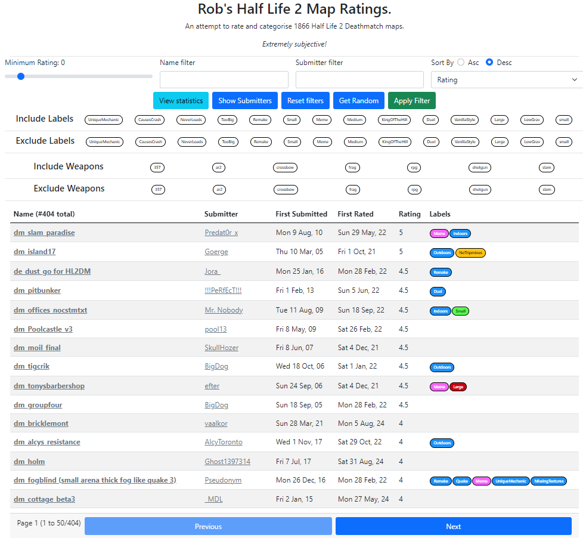

# Rob's Half Life 2 Map Ratings
*An attempt to rate and categorise over 1800 half life 2 deathmatch maps*

This repo contains our ratings for the map collection mostly scraped from [GameBanana](https://gamebanana.com/mods/cats/5328), and the code for a static site for presenting the information.

View the site here: [https://hl2.arbitrarydata.co.uk/](https://hl2.arbitrarydata.co.uk/)

A note on the ratings: Most of these ratings are given playing these maps with only 2 players. So there are some decent maps here that have low ratings just because they don't work very well with 2 players.

To add screenshots, run `node server.js`, open a map at `http://localhost:3000`, and enter edit mode. Paste an image with Ctrl+V. Screenshots save immediately, independently of the **Update info** button, and appear as thumbnails that open the full image in a new tab. PNG, JPEG, GIF and WebP images up to 20 MB are supported.

Screenshot files live in `docs/images/screenshots` with UUID filenames; each map's `RobScreenshots` entries in `docs/scrape_data.json` store their IDs and relative paths. Commit both the images and map data when publishing (`push-update.ps1` includes both).

